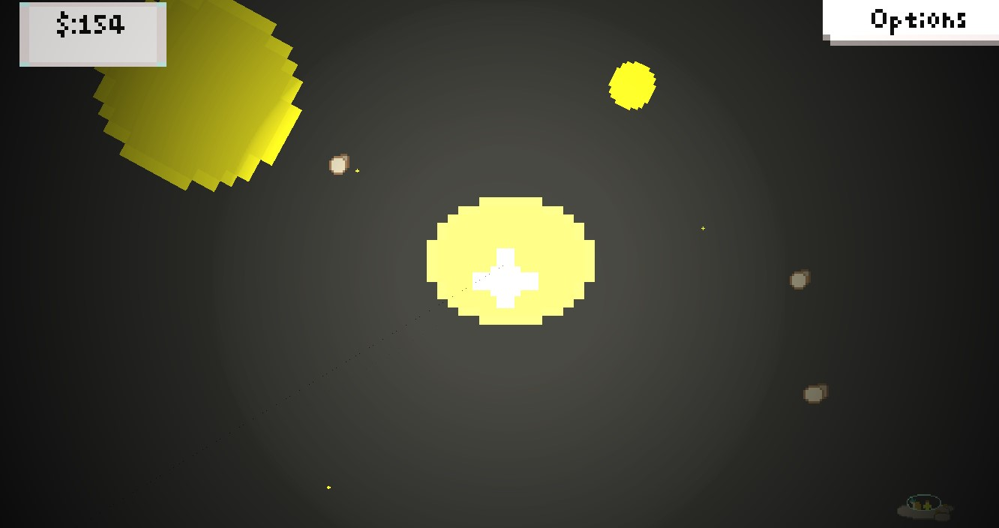
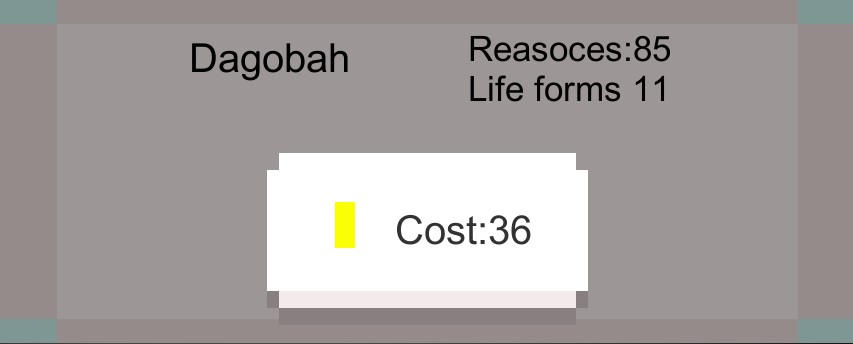
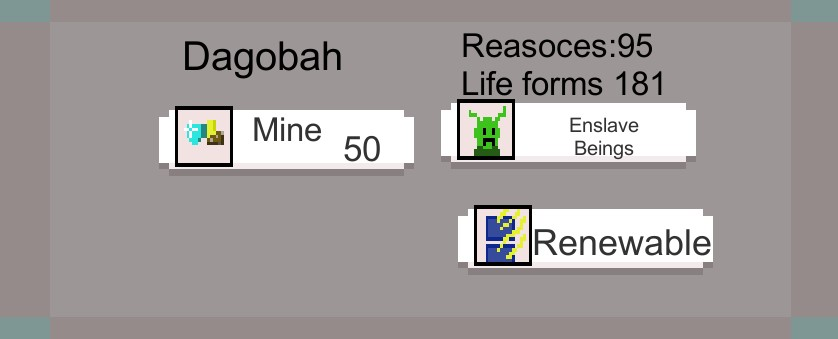

# Introduction to Universal Truth
Click planets to buy them, then start collecting, and try to not destroy everything.

Controls
* Movement - WASD
* Zoom - Mouse scroll wheel
* Click- Interact
* Most buttons are pressed again to shut off UI or try ESC 

##  Features
* Movement and physics
* 2d lighting
* UI control
* Interstellar Environment

###  Product Presentation

The world randomly generates Planets all around the sun, each with varying rotation speed and size.

When a planet is clicked, you are asked to buy it

When a planet is owned a medal will appear over it

Enslave life sells half the life on the planet, mine resources reduces the planet's resources by 50 and can reduce its size. each of these options can cost money but raise your income per round (a round is about 5 seconds)

[Itch.io page](https://magentaautumn.itch.io/universal-truth)
